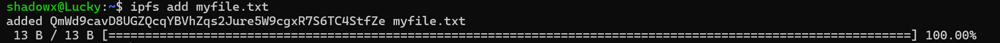
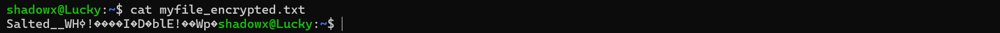
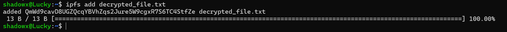

# IPFS Privacy and Encryption – Command Line Assignment

This project explains how to securely upload, encrypt, decrypt, and manage file privacy using **IPFS (InterPlanetary File System)** and **OpenSSL** via the command line.

---

## Objective

The aim is to learn how to:
- Add files to IPFS
- Encrypt files using AES-256 (OpenSSL)
- Decrypt encrypted files
- Store data privately on a decentralized file system

---

## Steps

### Step 1: Create a file with sample text
```bash
echo "Hello, IPFS!" > myfile.txt
```


---

### Step 2: Add the original file to IPFS
```bash
ipfs add myfile.txt
```



---

### Step 3: Encrypt the file with AES-256-CBC using OpenSSL
```bash
openssl enc -aes-256-cbc -pbkdf2 -iter 100000 -salt -in myfile.txt -out myfile_encrypted.txt -pass pass:Lucky@123
```


---

### Step 4: Upload the encrypted file to IPFS
```bash
ipfs add myfile_encrypted.txt
```


---

### Step 5: View the encrypted file
```bash
cat myfile_encrypted.txt
```



---

### Step 6: Decrypt the file using the same password
```bash
openssl enc -d -aes-256-cbc -pbkdf2 -iter 100000 -in myfile_encrypted.txt -out decrypted_file.txt -pass pass:Lucky@123
```


---

### Step 7: Check the decrypted content
```bash
cat decrypted_file.txt
```


---

### Step 8: Upload the decrypted file to IPFS again
```bash
ipfs add decrypted_file.txt
```



---

## Conclusion

This task shows how to:
- Encrypt data before storing it on IPFS
- Use strong encryption to protect access
- Verify integrity by decrypting and comparing files
- Understand content-based addressing in IPFS

> **Note:** Always keep your encryption password secure to protect your data on decentralized platforms.

---

