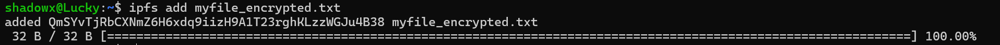
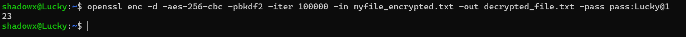
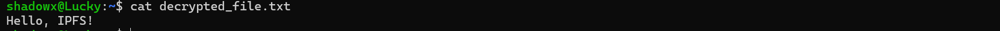

# 🔐 IPFS Privacy and Encryption – Command Line Assignment

This project demonstrates how to securely upload, encrypt, decrypt, and manage file privacy using **IPFS (InterPlanetary File System)** and **OpenSSL** through the command line.

---

## 📌 Objective

To understand how to:
- Add files to IPFS
- Perform AES-256 encryption using OpenSSL
- Decrypt encrypted files
- Maintain privacy while storing data on a decentralized file system

---

## 🧪 Steps Performed

### ✅ Step 1: Create a file with sample text
```bash
echo "Hello, IPFS!" > myfile.txt
```
📸  


---

### ✅ Step 2: Add original file to IPFS
```bash
ipfs add myfile.txt
```
📸  


---

### ✅ Step 3: Encrypt the file using AES-256-CBC (OpenSSL)
```bash
openssl enc -aes-256-cbc -pbkdf2 -iter 100000 -salt -in myfile.txt -out myfile_encrypted.txt -pass pass:Lucky@123
```
📸  


---

### ✅ Step 4: Add the encrypted file to IPFS
```bash
ipfs add myfile_encrypted.txt
```
📸  


---

### ✅ Step 5: View encrypted file contents
```bash
cat myfile_encrypted.txt
```
📸  


---

### ✅ Step 6: Decrypt the file using the same password
```bash
openssl enc -d -aes-256-cbc -pbkdf2 -iter 100000 -in myfile_encrypted.txt -out decrypted_file.txt -pass pass:Lucky@123
```
📸  


---

### ✅ Step 7: Verify the decrypted content
```bash
cat decrypted_file.txt
```
📸  


---

### ✅ Step 8: Add decrypted file back to IPFS
```bash
ipfs add decrypted_file.txt
```
📸  


---

## 📄 Conclusion

This assignment successfully demonstrates how to:
- Secure sensitive data before uploading to IPFS
- Protect access using AES encryption
- Verify data integrity by decrypting it again
- Understand how IPFS uses content-based addressing (same file = same CID)

> 🔐 **Security Tip:** Always keep your encryption password secret to maintain privacy on decentralized platforms.

---

